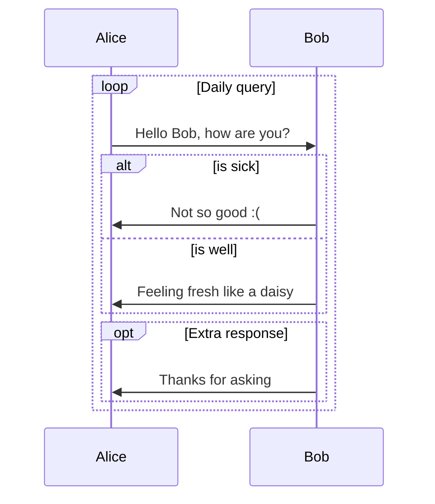

Welcome to [Hexo](https://hexo.io/)! This is your very first post. Check [documentation](https://hexo.io/docs/) for more info. If you get any problems when using Hexo, you can find the answer in [troubleshooting](https://hexo.io/docs/troubleshooting.html) or you can ask me on [GitHub](https://github.com/hexojs/hexo/issues).

## Quick Start

### Create a new post

``` bash
$ hexo new "My New Post"
```

More info: [Writing](https://hexo.io/docs/writing.html)

### Run server

``` bash
$ hexo server
```

More info: [Server](https://hexo.io/docs/server.html)

### Generate static files

``` bash
$ hexo generate
```

More info: [Generating](https://hexo.io/docs/generating.html)

### Deploy to remote sites

``` bash
$ hexo deploy
```


- title: 列表 1
  list:
    - https://music.163.com/#/playlist?id=2943811283
    - https://music.163.com/#/playlist?id=2297706586
- title: 列表 2
  list:
    - https://music.163.com/#/playlist?id=2031842656

  

- name: "测试 1"
  url: https://cdn.kastatic.org/ka-youtube-converted/O_nY1TM2RZM.mp4/O_nY1TM2RZM.mp4#t=0
- name: "测试 2"
  url: https://cdn.kastatic.org/ka-youtube-converted/O_nY1TM2RZM.mp4/O_nY1TM2RZM.mp4#t=0



- site: 優萌初華
  owner: 霜月琉璃
  url: https://shoka.lostyu.me
  desc: 琉璃的医学 & 编程笔记
  image: https://cdn.jsdelivr.net/gh/amehime/shoka@latest/images/avatar.jpg
  color: "#e9546b"

- site: 優萌初華
  owner: 霜月琉璃
  url: https://shoka.lostyu.me
  image: images/avatar.jpg

- site: 優萌初華
  url: https://shoka.lostyu.me
  desc: 琉璃的医学 & 编程笔记
  color: "#9d5b8b"


```java 行高亮 https://shoka.lostyu.me 参考链接 mark:1,6-7
import java.util.Scanner;
...
Scanner in = new Scanner (System.in);
// 输入 Scan 之后，按下键盘 Alt + “/” 键，Eclipse 下自动补全。

System.out.println (in.nextLine ());
System.out.println ("Hello" + "world.");
```

```bash 命令行提示符 command:("[root@localhost] $":1,9-10||"[admin@remotehost] #":4-6)
pwd
/usr/home/chris/bin
ls -la
total 2
drwxr-xr-x   2 chris  chris     11 Jan 10 16:48 .
drwxr--r-x  45 chris  chris     92 Feb 14 11:10 ..
-rwxr-xr-x   1 chris  chris    444 Aug 25  2013 backup
-rwxr-xr-x   1 chris  chris    642 Jan 17 14:42 deploy
git add -A
git commit -m "update"
git push
```

1. 编译时多态主要指运算符重载与函数重载，而运行时多态主要指虚函数。 {.quiz .true}

2. 有基类 `SHAPE`，派生类 `CIRCLE`，声明如下变量：  {.quiz .multi}
    ```cpp
    SHAPE shape1,*p1;
    CIRCLE circle1,*q1;
    ```
   下列哪些项是 “派生类对象替换基类对象”。
  - `p1=&circle1;` {.correct}
  - `q1=&shape1;`
  - `shape1=circle1;` {.correct}
  - `circle1=shape1;`
    {.options}
   > - :heavy_check_mark: 令基类对象的指针指向派生类对象
   > - :x: 派生类指针指向基类的引用
   > - :heavy_check_mark: 派生类对象给基类对象赋值
   > - :x: 基类对象给派生类对象赋值
       > {.options}

3. 下列叙述正确的是 []{.gap} 。 {.quiz}
  - 虚函数只能定义成无参函数
  - 虚函数不能有返回值
  - 能定义虚构造函数
  - A、B、C 都不对 {.correct}
    {.options}

10. 如果定义 `int e=8; double f=6.4, g=8.9;`，则表达式 `f+int (e/3*int (f+g)/2)%4` 的值为 [9.4]{.gap}。 {.quiz .fill}
    > 注意运算顺序和数据类型
    > [8.4]{.mistake}

  
行内公式: $\sqrt {3x-1}+(1+x)^2$

独立块显示：
$$\begin {array}{c}

\nabla \times \vec {\mathbf {B}} -\, \frac1c\, \frac {\partial\vec {\mathbf {E}}}{\partial t} &
= \frac {4\pi}{c}\vec {\mathbf {j}}    \nabla \cdot \vec {\mathbf {E}} & = 4 \pi \rho \\

\nabla \times \vec {\mathbf {E}}\, +\, \frac1c\, \frac {\partial\vec {\mathbf {B}}}{\partial t} & = \vec {\mathbf {0}} \\

\nabla \cdot \vec {\mathbf {B}} & = 0

\end {array}$$

:kissing_heart:
:ring:
:notes:

```mermaid
graph LR
    A [Square Rect] -- Link text --> B ((Circle))
    A --> C (Round Rect)
    B --> D {Rhombus}
    C --> D
```



++下划线++
++波浪线++{.wavy}
++着重点++{.dot}
++紫色下划线++{.primary}
++绿色波浪线++{.wavy .success}
++黄色着重点++{.dot .warning}
~~删除线～～
~~红色删除线～～{.danger}
==荧光高亮==
[赤橙黄绿青蓝紫]{.rainbow}
[红色]{.red}
[粉色]{.pink}
[橙色]{.orange}
[黄色]{.yellow}
[绿色]{.green}
[靛青]{.aqua}
[蓝色]{.blue}
[紫色]{.purple}
[灰色]{.grey}
快捷键 [Ctrl]{.kbd} + [C]{.kbd .red}
H~2~0
29^th^

!! 黑幕黑幕黑幕黑幕黑幕黑幕！！： 鼠标滑过显示内容
!! 模糊模糊模糊模糊模糊模糊！！{.bulr} ： 选中文字显示内容

[default]{.label}
[primary]{.label .primary}
[info]{.label .info}
[:heavy_check_mark:success]{.label .success}
[warning]{.label .warning}
[:broken_heart:danger]{.label .danger}

:::default
默认默认
:::

:::primary
基本基本
:::

:::info
提示提示
:::

:::success
成功成功
:::

:::warning
警告警告
:::

:::danger
危险危险
:::

:::danger no-icon
危险危险
:::

;;;id1 卡片 1
这里是卡片 1 的内容
** 加粗 **
[success]{.label .success}


- site: 優萌初華
  owner: 霜月琉璃
  url: https://shoka.lostyu.me
  desc: 琉璃的医学 & 编程笔记
  image: https://cdn.jsdelivr.net/gh/amehime/shoka@latest/images/avatar.jpg
  color: "#e9546b"
  
  ;;;

;;;id1 卡片 2
这里是卡片 2 的内容
:::danger
危险危险
:::
- 第一行
- 第二行
  ;;;

;;;id2 ②号标签卡片 1
这里是卡片 1 的内容
;;;

;;;id2 ②号标签卡片 2
这里是卡片 2 的内容
;;;


+++ 默认默认 这里是一段文字
++ 下划线 ++
+++


+++primary 紫色
:::info
参考信息
:::

- 第一行
- 第二行
  +++


+++info  蓝色
;;;id3 卡片 1
这里是卡片 1 的内容
;;;

;;;id3 卡片 2
这里是卡片 2 的内容
;;;
+++

+++success 绿色

- site: 優萌初華
  url: https://shoka.lostyu.me
  color: "#e9546b"
  
  +++

+++warning 黄色
!! 警告警告警告警告警告！！{.bulr}
[label]{.label .success}
+++

+++danger 红色
[danger]{.label .danger}
+++

- [ ] 这是一个小叉叉
- [x] 这是一个红色勾勾

{.danger}

- [ ] 未完成
- [x] 完成

{.primary}

- [ ] 未完成
- [x] 默认颜色


{height="100px" width="400px"}

{width="400px"}

{height="100px"}

## 图案列表 No.1


{.gallery}

## 图案列表 No.2


{.gallery data-height="120"}
